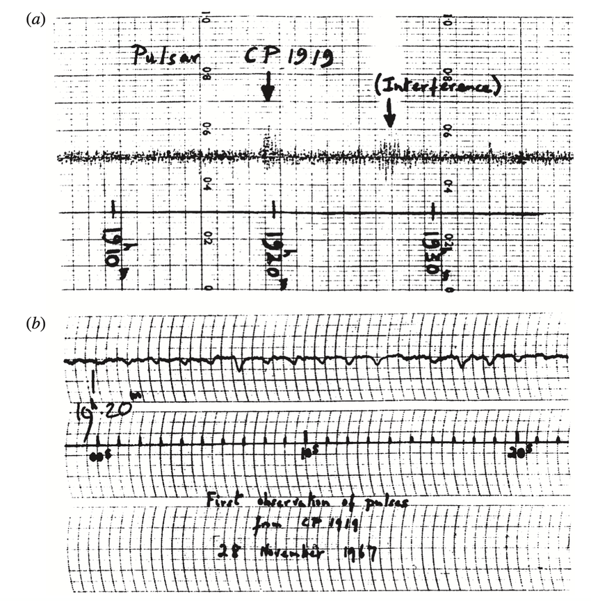

Data Visualisation in Timeseries Analysis Primer
=================================================

In 1967, working as a postgraduate student under the direction of Antony Hewish, Jocelyn Bell Burnell discovered the first pulsar, named CP1919 to abbreviate "Cambridge pulsar at 19 hours 19 minutes right ascension". The discovery was highly unexpected, taking place during Bell Burnell's research on quasars and appearing as a "one part in 10 million" squiggle on a long line of noisy radiowave telescope data. Identifying the periodic nature of this mysterious anomaly was even more challenging, requiring Bell Burnell to manually sift through long rolls of chart recordings and take observations using a number of different radiowave telescopes. Even at this stage, confirming whether the squiggle was truly an anomalous signal or simply part of the human-generated interference could not be done with ease or certainty.

Pulsars are of great scientific interest for a multitude of reasons. As explained by Bell Burnell herself:

"They’re extremely small, about ten miles across, and very dense because they’re formed when stars of a certain size catastrophically explode. Pulsars are visible because they swing a beam of radiowaves around the sky, a bit like a lighthouse, and when that beam shines at a radio telescope, you pick up a very accurate pulse, pulse, pulse, pulse; like ‘clocks’ dotted throughout the galaxy. They have a lot of extreme physics going on inside them and scientists use them to test theories of relativity on a cosmic scale."

The data from which this discovery was made is an analogue form of **timeseries data**. Such datasets track a sample over time and often invlove some form of periodic behaviour, putting them at the core of several areas of physics and especially astronomy. Outside of lucky coincidences like this, tracking and detecting the faint, cyclic radiowave flashes originating from pulsars is incredibly challenging for a human observer with only a pen and paper. This notebook will demonstrate how a `timeseries anomaly detection <https://huggingface.co/keras-io/timeseries-anomaly-detection>`_ model based on an autoencoder can be used to make timeseries analysis significantly more visual and automatic. To detect and visualise artificial hidden anomalies, we will be using the open-source `Numenta Anolmaly Benchmark (NAB) <https://www.kaggle.com/datasets/boltzmannbrain/nab>`_ dataset.

`Figure (1) <https://www.researchgate.net/figure/The-discovery-records-of-the-first-pulsar-discovered-PSR-1919-21-aThe-scintillation_fig3_347880951>`_ : The timeseries data from which Jocelyn Bell Burnell identified CP1919.
